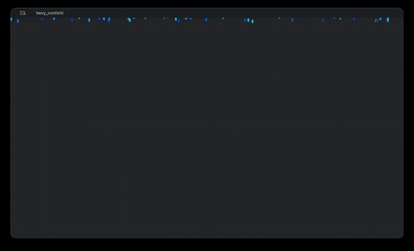

# bevy_confetti

A crate focused on implementing simple confettis for 2D/3D.
For a more complex particle system checkout [bevy_hanabi](https://github.com/djeedai/bevy_hanabi).

<p align="center">
    
</p>

```bash
# To compile the example
cargo run --example 2D
```

## Compatible Bevy versions

The `main` branch is compatible with the latest Bevy release.

| `bevy_confetti` | `bevy` |
| :--           | :--    |
| `0.17`        | `0.17` |